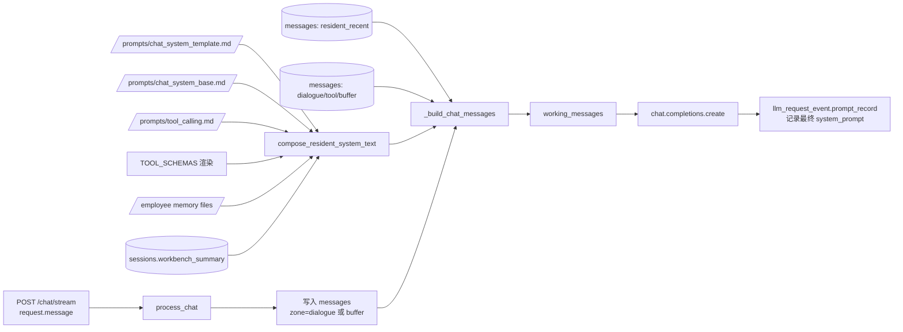
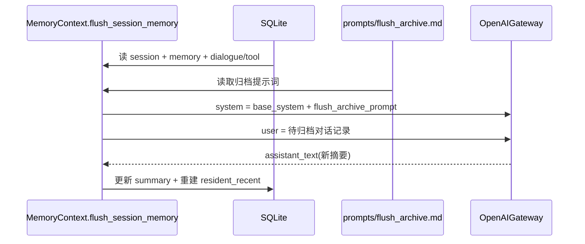

# LLM 调用提示词来源总览（新版本）

## 1. 总体原则

当前版本不再从记忆目录读取 `系统提示词.md`。

文本模型的 system prompt 统一由“模板 + 注入”构成：

1. 根目录 `prompts/chat_system_template.md` 定义结构与占位符
2. 运行时读取底层提示词、工具清单、各类记忆，注入到占位符

再叠加会话摘要与历史消息，组成最终发送给 LLM 的 `messages`。

## 2. 提示词来源清单

| 来源类别 | 具体来源 | 存储位置 | 如何进入模型请求 |
|---|---|---|---|
| System 模板 | `chat_system_template.md` | `prompts/chat_system_template.md` | 作为主模板，包含记忆占位符 |
| 底层系统提示词 | `chat_system_base.md` | `prompts/chat_system_base.md` | 注入占位符 `{{BASE_SYSTEM_PROMPT}}` |
| 工具调用提示词 | `tool_calling.md` | `prompts/tool_calling.md` | 注入占位符 `{{TOOL_CALLING_PROMPT}}` |
| 动态工具清单 | `TOOL_SCHEMAS` 渲染文本 | 代码常量 | 拼入 system 区段：`### 可用工具清单（只读）` |
| 记忆文件 | `memory.md` + `notebook/*.md`（排除 `file.md`） | `data/user/<user_id>/employee/<employee_id>/` | 按类别注入 `{{MEMORY_*}}` 占位符 |
| 会话摘要 | `workbench_summary` | `sessions.workbench_summary` | 作为独立 section：`工作台摘要` |
| 近期常驻消息 | `resident_recent` | `messages.zone=resident_recent` | 按 `recent_raw_limit` 裁剪后加入 messages |
| 活跃消息 | `dialogue/tool/buffer` | `messages.zone in (...)` | 按 `dialogue_limit` 裁剪后加入 messages |
| 工具回放消息 | `tool_call/tool_result` 事件行 | `messages.zone=tool` | 还原为 `assistant(tool_calls)` + `tool` 协议消息 |
| 运行时工具结果 | 本轮工具执行输出 | 进程内 `working_messages` | 每轮工具执行后 append，进入下一轮模型调用 |

## 3. 聊天调用链路

`POST /chat/stream` 的提示词拼装顺序：

1. 写入本轮用户输入（`dialogue` 或 `buffer`）
2. 读取 `prompts/chat_system_template.md`
3. 收集注入变量（底层提示词、工具清单、分类记忆）
4. 注入占位符得到最终 resident system 文本
5. 读取会话摘要 section
6. 读取 `resident_recent + dialogue/tool/buffer` 消息并按预算裁剪
7. 拼成 `messages=[system, ...history]` 发给 LLM

## 4. 刷盘归档链路

刷盘时会单独读取 `prompts/flush_archive.md` 作为归档专用提示词：

1. 先构造 base system（同聊天链路）
2. 读取 `prompts/flush_archive.md`
3. system = `base_system + flush_archive_prompt`
4. user = `dialogue + tool` 拼接文本
5. 调用 LLM 生成新摘要并回写

## 5. 边界说明

1. 不再存在“`系统提示词.md` 专用入口”这一机制。
2. 所有底层提示词均来自根目录 `prompts/`，可直接版本化管理。
3. 模型可用工具仍由 API `tools` 参数约束；system 中的“可用工具清单”仅用于可读提示。
4. token 预算逻辑不变：`system_prompt_limit + summary_limit + recent_raw_limit + dialogue_limit`。

## 6. 代码定位

- resident system 拼装：`domain/prompt_composer.py`
- 提示词模板读取：`domain/prompt_templates.py`
- 聊天主流程：`app/chat/services/memory_context_service.py`
- 工具循环：`infra/chat/openai_gateway.py`、`infra/llm/tool_loop.py`
- 工具 schema：`infra/tools/tool_registry.py`
- 记忆文件仓储：`infra/memory/file_repository.py`
