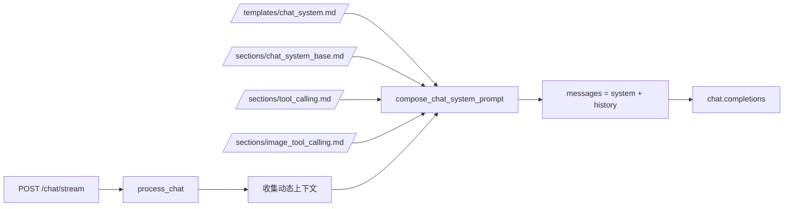

# LLM 提示词结构总览（模板化版本）

## 1. 设计目标

当前提示词构建采用统一范式：

1. 先定义模板（只保留结构和占位符）
2. 运行时准备各部分提示词与动态数据
3. 统一注入占位符，得到最终请求文本

这样可以将“结构设计”和“内容维护”解耦，便于在 `prompts/` 目录内按类型快速修改。

## 2. 目录结构

```text
prompts/
├── README.md
├── templates/
│   ├── chat_system.md
│   ├── flush_archive_system.md
│   └── image_generation.md
└── sections/
    ├── chat_system_base.md
    ├── tool_calling.md
    ├── image_tool_calling.md
    ├── flush_archive.md
    └── image_generation_base.md
```

- `templates/`：框架文件（调用类型级别）
- `sections/`：可复用片段（角色、策略、任务说明）

## 3. 三类调用与模板

| 调用类型 | 模板文件 | 注入片段 | 动态注入 | 调用入口 |
|---|---|---|---|---|
| 数字员工会话（chat） | `prompts/templates/chat_system.md` | `chat_system_base.md` + `tool_calling.md` + `image_tool_calling.md` | 窗口预算、工具清单、记忆文件、摘要 | `PromptComposer.compose_resident_system_text` |
| 归档刷盘（flush） | `prompts/templates/flush_archive_system.md` | `flush_archive.md` | 常驻 system 文本 | `MemoryContextService.flush_session_memory` |
| 画图模型（image） | `prompts/templates/image_generation.md` | `image_generation_base.md` | 用户原始画图需求 | `ImageToolService.generate_image_to_workspace` |

## 4. 运行时拼装流程

### 4.1 聊天主链路（`POST /chat/stream`）

1. 写入本轮用户消息（`dialogue` 或 `buffer`）
2. 收集动态变量：窗口预算、工具清单、分类记忆、工作台摘要
3. 使用 `compose_chat_system_prompt(...)` 注入 `chat_system.md`
4. 叠加历史消息后调用 `chat.completions`

补充：

- 固定预算为 `10% system + 10% recent + 80% dialogue`。
- `dialogue` 内可同时包含 `chat/tool_call/tool_result` 三种消息类型。
- `buffer` 只在刷盘期间启用，容量与 `dialogue_limit` 相同，超限会拒绝新消息。



### 4.2 刷盘链路（`flush_session_memory`）

1. 先生成常驻 `base_system`
2. 使用 `compose_flush_archive_system_prompt(...)` 注入 `flush_archive_system.md`
3. 以归档对话为 user 输入调用 `chat.completions`

### 4.3 画图链路（`image_gen_edit` 工具）

1. 收到工具参数中的用户画图需求
2. 使用 `compose_image_generation_prompt(...)` 注入 `image_generation.md`
3. 将注入后的文本发送到 `images.generate`

## 5. 关键实现位置

- 模板读取与注入：`domain/prompt_templates.py`
- 聊天 system 组装：`domain/prompt_composer.py`
- 聊天主流程：`app/chat/services/memory_context_service.py`
- 图片模型调用：`infra/tools/image_tool.py`

## 6. 维护建议

1. 调整“结构顺序/区块布局”时，仅改 `templates/`。
2. 调整“角色语气/策略细节”时，仅改 `sections/`。
3. 新增调用类型时，先新增 `templates/<type>.md`，再按需补充 `sections/`，最后在 `domain/prompt_templates.py` 增加对应 `compose_*` 方法。
