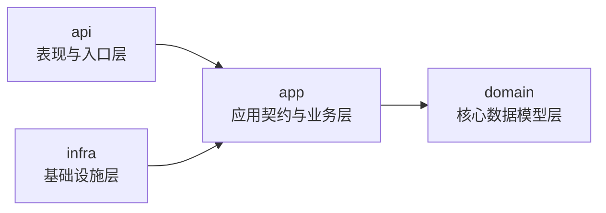
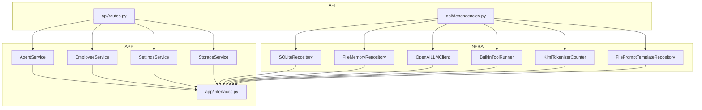
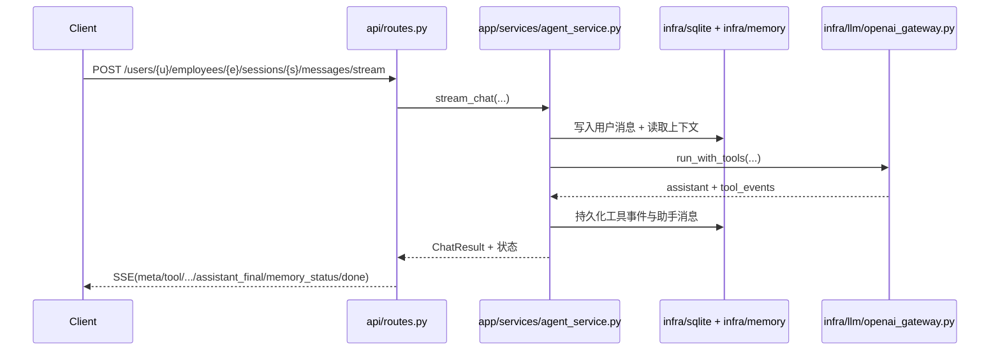

# 项目结构说明（Clean Architecture）

本文档聚焦“代码怎么组织、依赖怎么流动、请求怎么流转”，用于快速理解当前项目结构。

## 1. 顶层目录

```text
agent-demo/
├── api/        # 表现层：FastAPI 路由、DTO、SSE 封包、响应协议
├── app/        # 应用层：接口抽象 + 核心业务服务
├── domain/     # 领域层：纯数据模型（dataclass）
├── infra/      # 基础设施层：SQLite/文件系统/LLM/工具/提示词模板适配器
├── prompts/    # 提示词模板与片段（资源文件）
├── static/     # 前端静态资源
├── docs/       # 文档
├── test/       # 单元测试与架构守卫测试
├── main.py     # FastAPI 应用入口
└── run.py      # 本地开发启动脚本
```

## 2. 四层依赖规则

依赖必须单向向内：

- `api -> app -> domain`
- `infra -> app -> domain`
- `domain` 不依赖其他层



## 3. 各层核心文件

### 3.1 api 层

- `api/routes.py`：资源化 REST 路由 + SSE 聊天流接口
- `api/dependencies.py`：依赖组装入口（唯一 new infra 的地方）
- `api/schemas.py`：请求 DTO 与参数规范化
- `api/response.py`：统一响应封包
- `api/sse.py`：SSE 事件信封构造器

### 3.2 app 层

- `app/interfaces.py`：全部抽象接口（abc）
- `app/services/agent_service.py`：聊天、记忆状态、压缩主流程
- `app/services/employee_service.py`：员工与会话管理
- `app/services/settings_service.py`：模型配置读取与更新
- `app/services/storage_service.py`：文件/目录业务语义封装

### 3.3 domain 层

- `domain/models.py`：纯数据结构（`GlobalSettings`、`LLMConfig`、`MemoryStatus` 等）

### 3.4 infra 层

- `infra/sqlite/repository.py`：会话/消息/设置仓储实现
- `infra/memory/file_repository.py`：记忆文件仓储实现
- `infra/llm/openai_gateway.py`：LLM 客户端实现（含工具循环）
- `infra/tools/*`：工具执行、时钟、schema 提供器
- `infra/prompts/template_repository.py`：提示词模板读取与渲染

## 4. 运行时装配关系



## 5. 典型请求流（SSE 聊天）



## 6. 架构守卫测试

为防止结构退化，项目包含测试：

- `test/test_architecture_guards.py`
  - 禁止 `common/` 回流
  - 禁止 `app/ports` 回流
  - 校验层间导入方向
  - 校验 `domain` 不导入框架库

## 7. 阅读建议

推荐阅读顺序：

1. `main.py`（入口与全局异常）
2. `api/dependencies.py`（依赖组装图）
3. `api/routes.py`（外部接口）
4. `app/services/agent_service.py`（核心业务）
5. `infra/*`（外部系统实现细节）
