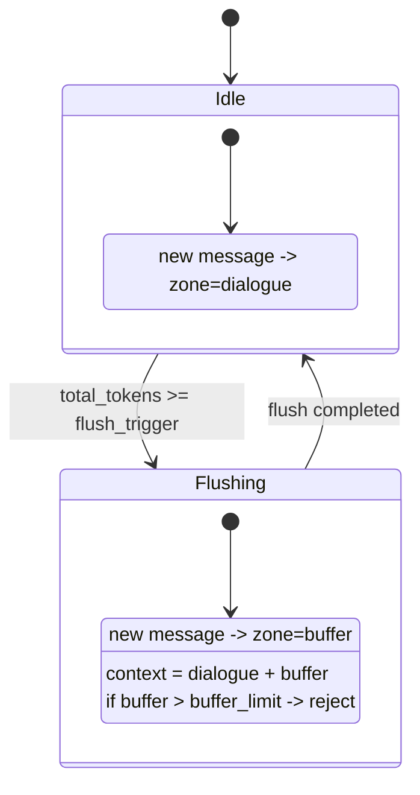

# Session Window 与刷盘状态机

## 1. 目标

本文统一定义员工会话的窗口预算、消息模型与刷盘状态机，作为实现与排障的单一事实来源。

## 2. 固定窗口预算

总窗口按固定 100% 切分：

- 系统区（system + 记忆）：10%
- 最近区（recent）：10%
- 对话区（dialogue）：80%

最近区内部再切分：

- 摘要：1%
- 最近原始对话：9%

其中：

- `dialogue_limit = 80%`
- `buffer_limit = dialogue_limit`
- `buffer` 仅在刷盘期间启用，不计入固定 100%

## 3. 两层消息模型

消息语义拆分为两层，禁止混用：

1. 生命周期分区（`zone`）
- `dialogue`
- `buffer`
- `resident_recent`

2. 消息类型（`message_kind`）
- `chat`
- `tool_call`
- `tool_result`

说明：

- `zone` 只回答“消息处于哪个阶段”。
- `message_kind` 只回答“消息是什么类型”。

## 4. 状态机

## 5. 刷盘完成后的重排规则

刷盘成功后严格按以下顺序：

1. 旧 `dialogue` 做归档总结
2. 从旧 `dialogue` 抽取近期 `chat` 消息写入 `resident_recent`
3. 收集 `buffer` 全量消息
4. 清空会话消息
5. 将 `buffer` 消息迁移到新的 `dialogue`
6. 置 `is_flushing=false`

语义结果：

- 旧 `dialogue` 已归档并沉淀到最近区
- 刷盘期间新增内容继续保留为后续主对话

## 6. 实现锚点

- 阈值策略：`domain/window_policy.py`
- 聊天主流程：`app/chat/services/memory_context_service.py`
- 工具协议恢复：`domain/tool_protocol.py`
- 持久化模型：`infra/sqlite/repository.py`
