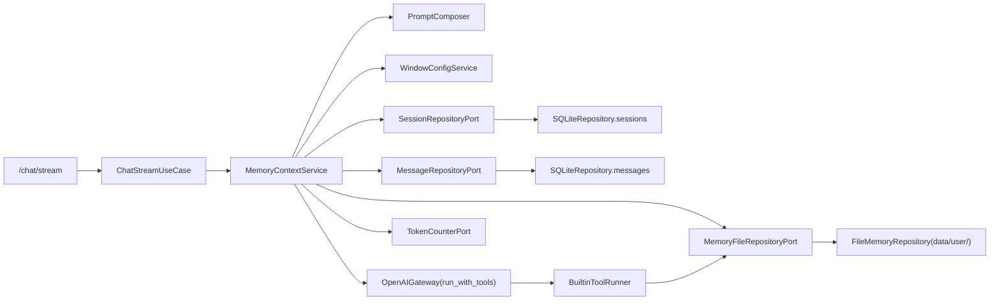
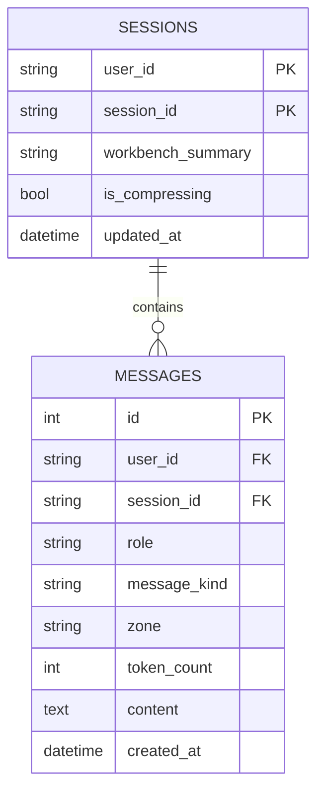
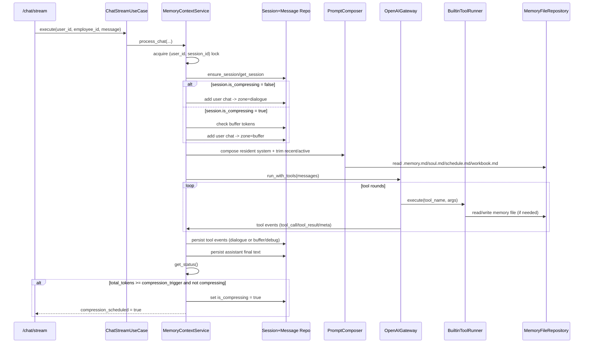
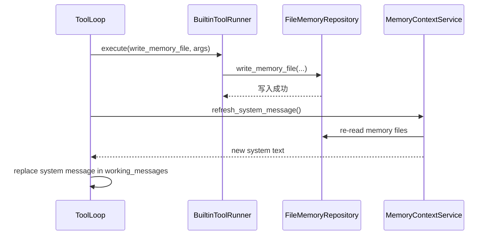
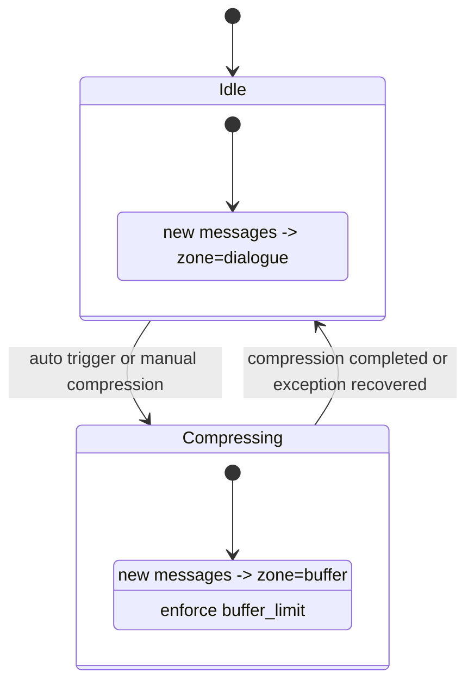
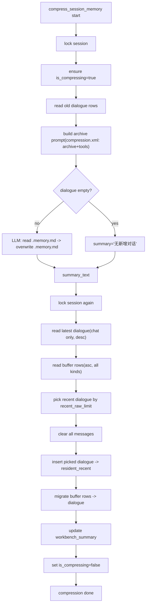

# 记忆模块详解

## 1. 文档定位

本文档是“记忆模块”的实现级说明，目标是把记忆相关能力讲清楚，包括：

1. 记忆模块的职责边界与核心组件
2. 记忆数据在 SQLite 与文件系统中的组织方式
3. 聊天过程中记忆如何参与上下文构建、工具读写和 token 预算
4. 自动/手动压缩的完整执行细节
5. 并发、异常与排障要点

本文档不重复 API 全字段定义（参见 `api_and_streaming.md`），不重复提示词模板原文（参见 `prompt_system.md`）。

## 2. 模块总览

### 2.1 核心职责

记忆模块负责以下四件事：

1. 管理会话级消息分区（`dialogue` / `buffer` / `resident_recent`）
2. 管理员工级长期记忆文件（`.memory.md`、`notebook/*.md`）
3. 在每轮对话前构建“可控预算”的 system memory 上下文
4. 在阈值触发或手动触发时执行压缩归档

### 2.2 组件关系图



## 3. 记忆数据模型

### 3.1 会话状态（`sessions`）

`sessions` 表中与记忆直接相关的字段：

- `workbench_summary`：压缩后保存的摘要（用于常驻 system 摘要区）
- `is_compressing`：是否处于压缩期
- `updated_at`：会话最后更新时间

`session_id` 约定为 `employee-{employee_id}`，例如 `employee-1`。

### 3.2 消息模型（`messages`）

记忆模块将消息拆成“生命周期分区 + 消息类型”两层语义：

1. `zone`（生命周期）：
   - `dialogue`：主对话区
   - `buffer`：压缩期间新增消息暂存区
   - `resident_recent`：压缩后保留的近期对话区
   - `debug`：内部元事件（如 `llm_request`），不参与模型输入
2. `message_kind`（消息类型）：
   - `chat`
   - `tool_call`
   - `tool_result`
   - `meta`（仅 debug 区）

### 3.3 数据关系图



## 4. 记忆文件体系

### 4.1 目录结构

每个用户下每个员工都有独立记忆目录：

```text
data/user/<user_id>/employee/<employee_id>/
├── .memory.md
├── notebook/
│   ├── soul.md
│   ├── schedule.md
│   ├── workbook.md
│   └── file.md
├── workspace/
└── skills/
```

### 4.2 文件映射规则

由 `domain/chat/memory_files.py` 定义：

- `.memory.md` -> `employee/<id>/.memory.md`
- `soul.md` / `schedule.md` / `workbook.md` / `file.md` -> `employee/<id>/notebook/*.md`
- 未知 `*.md` 默认落在 `notebook/`
- 不提供 `memory.md` 兼容读取或自动迁移；压缩记忆文件名固定为 `.memory.md`

### 4.3 初始化与重置

`FileMemoryRepository` 会确保：

1. 首次访问自动创建用户目录、员工目录、`notebook/workspace/skills`
2. 自动写入初始化模板文件（不覆盖已有内容）
3. 重置员工时清理记忆 Markdown 后重建初始化内容

## 5. token 预算与记忆窗口

预算来自 `WindowThresholds.from_total_limit(...)`：

- `system_prompt_limit` = 10%
- `summary_limit` = 1%
- `recent_raw_limit` = 9%
- `dialogue_limit` = 剩余 80%
- `buffer_limit = dialogue_limit`
- `compression_trigger = total_limit`

公式：

```text
normalized_total = max(20000, total_token_limit)
system_prompt_limit = floor(normalized_total * 10%)
summary_limit       = floor(normalized_total * 1%)
recent_raw_limit    = floor(normalized_total * 9%)
resident_limit      = system_prompt_limit + summary_limit + recent_raw_limit
dialogue_limit      = normalized_total - resident_limit
buffer_limit        = dialogue_limit
compression_trigger       = normalized_total
```

记忆模块最终状态汇总口径（`MemoryStatus`）：

```text
resident_tokens = resident_static_tokens + resident_recent_tokens
dialogue_tokens = SUM(zone='dialogue')
buffer_tokens   = SUM(zone='buffer')
total_tokens    = resident_tokens + dialogue_tokens + buffer_tokens
```

## 6. 聊天时的记忆执行细节

### 6.1 单轮流程时序图



### 6.2 system 记忆拼装细节

`PromptComposer.compose_resident_system_text(...)` 会做三件事：

1. 读取四个记忆文件：`.memory.md`、`soul.md`、`schedule.md`、`workbook.md`
2. 结合工具 schema、窗口预算，渲染 `chat.xml` 的记忆区块
3. 将 `workbench_summary` 按 `summary_limit` 裁剪后拼到 system 末尾

最终发给模型的消息结构是：

- 第一条固定 `system`（包含记忆与摘要）
- `resident_recent`（按 recent_raw 预算裁剪）
- `dialogue + buffer`（按 dialogue 预算裁剪）

### 6.3 工具事件的持久化规则

`_persist_tool_events(...)` 对事件分类落库：

1. `tool_call` -> `role=assistant`, `message_kind=tool_call`, zone 跟随当前阶段（`dialogue` 或 `buffer`）
2. `tool_result` -> `role=tool`, `message_kind=tool_result`, zone 同上
3. `meta(llm_request/llm_response/llm_error/state_refresh)` -> `zone=debug`, `message_kind=meta`

`debug` 区不会参与 `_build_chat_messages(...)`，因此不会污染模型输入上下文。

## 7. 写记忆后“即时生效”机制

在聊天主链路中，当工具调用 `write_memory_file` 成功后，`tool_loop.py` 会触发 `refresh_system_message`：



这意味着同一轮工具链中的“后续模型轮次”可以立刻看到更新后的记忆，不需要等下一个用户请求。  
压缩链路当前不依赖该刷新机制，压缩场景使用独立的 `compression.xml` system 提示词。

## 8. 压缩（compression）完整机制

### 8.1 状态机



### 8.2 压缩执行流



### 8.3 关键实现细节

1. 归档输入使用“旧 `dialogue` 全量文本”（含工具消息内容）。
2. 归档 system 由 `compression.xml` 构建，并同时注入 `compression_base_prompt.md` 与 `tools_base_prompt.md`（含工具定义），用于辅助模型熟悉可用工具；不注入 `chat.xml` 常驻内容。
3. 压缩任务提示词要求读取当前 `.memory.md`，再将提炼后的完整新内容以 `mode=overwrite` 写回 `.memory.md`。
4. 回填 `resident_recent` 时只保留 `role in {user, assistant}` 且 `message_kind=chat` 的近期消息。
5. 压缩期间产生的 `buffer` 会完整迁回 `dialogue`，包括 `tool_call/tool_result`。
6. 任何异常都会在 `except` 中回收 `is_compressing=false`，避免会话长期卡死。

## 9. 对外入口（与记忆强相关）

### 9.1 Chat 路由

- `POST /chat/stream`
  - 输出 `memory_status` 事件
  - 当触发自动压缩时输出 `meta: {compression_scheduled: true}`
- `GET /chat/memory/status`
  - 返回当前 `MemoryStatus`
- `POST /chat/memory/compression`
  - 尝试抢占手动压缩，成功后后台执行

### 9.2 Storage/User 路由

- `GET /storage/tree` / `GET|PUT /storage/file-content`：查看与编辑记忆文件
- `POST /user/employees/{employee_id}/reset`：删除员工数据后重建记忆模板

## 10. 并发一致性与保护机制

1. 会话锁粒度是 `(user_id, session_id)`，同会话串行，跨会话并行。
2. `buffer` 写入前会做容量校验：
   - `existing_buffer_tokens + incoming_tokens <= buffer_limit`
3. 自动压缩只打标记，由后台任务执行，避免阻塞当前回复链路。
4. 手动压缩通过 `try_start_manual_compression` 进行抢占，避免重复并发触发。

## 11. 常见边界行为

1. 记忆文件读取失败时，system 拼装会回退为 `(暂无内容)`，不中断主流程。
2. 裁剪后若工具协议断裂（孤立 tool_result），会通过 `sanitize_active_rows_for_tool_protocol` 修复。
3. 工具参数解析失败/缺参时，仍会生成 `tool_call + tool_result(error)` 事件，保证事件链完整可回放。
4. `debug` 分区消息不参与 prompt 输入，也不计入 `total_tokens` 汇总口径。

## 12. 运维排障清单

### 12.1 SQL 检查

查看分区与类型 token 分布：

```sql
SELECT zone, message_kind, COALESCE(SUM(token_count), 0) AS total_tokens
FROM messages
WHERE user_id = ? AND session_id = ?
GROUP BY zone, message_kind;
```

查看会话是否卡在压缩：

```sql
SELECT user_id, session_id, is_compressing, updated_at
FROM sessions
WHERE user_id = ? AND session_id = ?;
```

### 12.2 现场判断顺序

1. 检查 `is_compressing` 是否长期为 `1`
2. 检查 `buffer` token 是否接近 `buffer_limit`
3. 检查 `workbench_summary` 是否被刷新
4. 检查员工目录下 `.memory.md` 与 `notebook/*.md` 是否有预期写入
5. 检查 SSE 是否输出 `memory_status` 与 `compression_scheduled` 事件


