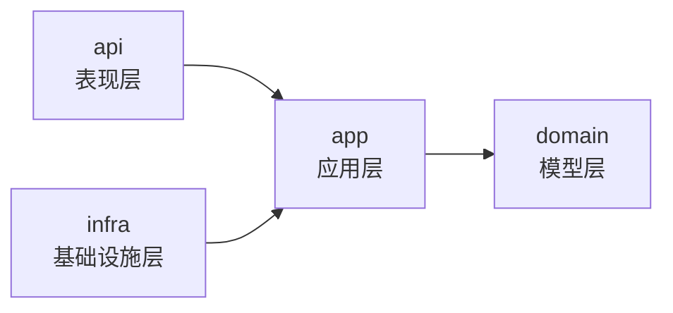
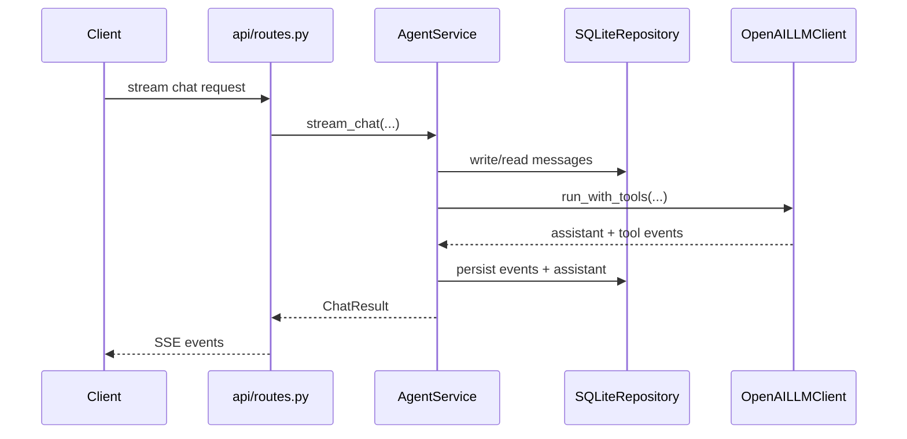

# 系统设计（Clean Architecture）

## 1. 目标

本系统采用四层 Clean Architecture，核心目标：

- 业务逻辑与外部框架解耦。
- 依赖方向可验证、可维护。
- 模块可替换（仓储、LLM、工具、提示词仓储均可替换实现）。

## 2. 分层与依赖

规则：

- `api` 只做协议转换、参数校验、响应封装。
- `app` 只依赖 `app/interfaces.py` 抽象与 `domain` 模型。
- `infra` 实现 `app` 定义的抽象，不承载业务决策。
- `domain` 只保留纯数据模型，不含流程逻辑。

## 3. 核心组件

### 3.1 API

- `api/routes.py`：资源化 REST + SSE 路由。
- `api/dependencies.py`：依赖组装入口。
- `api/schemas.py`：请求 DTO。

### 3.2 App

- `AgentService`：聊天、记忆状态、压缩主流程。
- `EmployeeService`：员工管理。
- `SettingsService`：全局设置管理。
- `StorageService`：文件管理业务语义。

### 3.3 Infra

- `SQLiteRepository`：会话/消息/设置仓储。
- `FileMemoryRepository`：文件系统仓储。
- `OpenAILLMClient`：模型调用与工具循环。
- `FilePromptTemplateRepository`：提示词模板读取与渲染。

## 4. 请求链路（聊天）

## 5. 结构守护

通过 `test/test_architecture_guards.py` 自动校验：

- 禁止 `common/` 与 `app/ports` 回流。
- 校验四层导入方向。
- 校验 `domain` 不导入框架库。

## 6. 相关文档

- [project_structure.md](project_structure.md)
- [state_and_persistence.md](state_and_persistence.md)
- [api_and_streaming.md](api_and_streaming.md)
