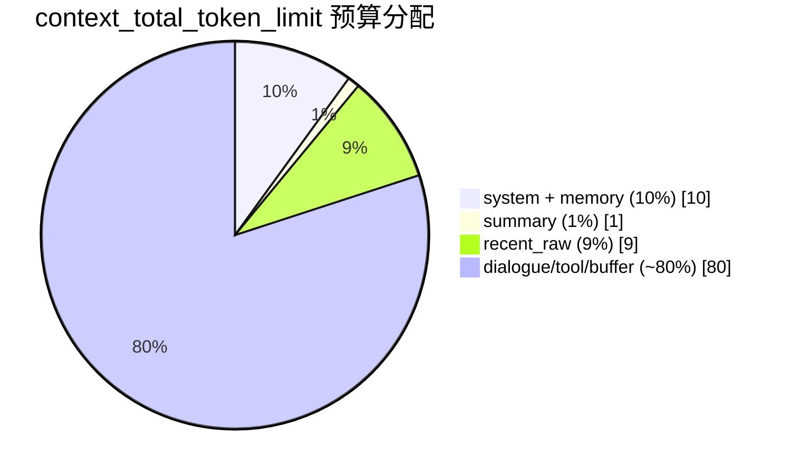
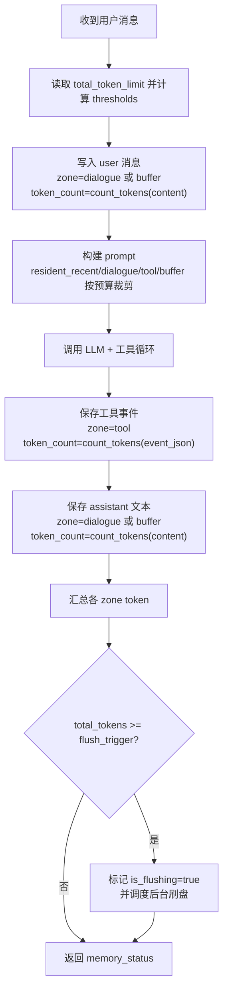
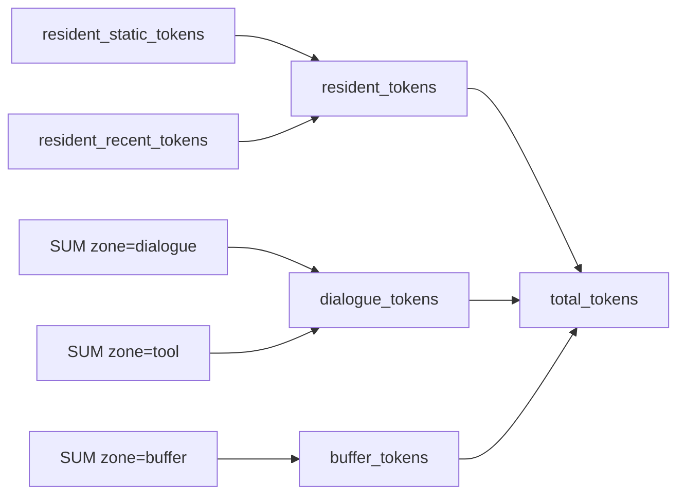
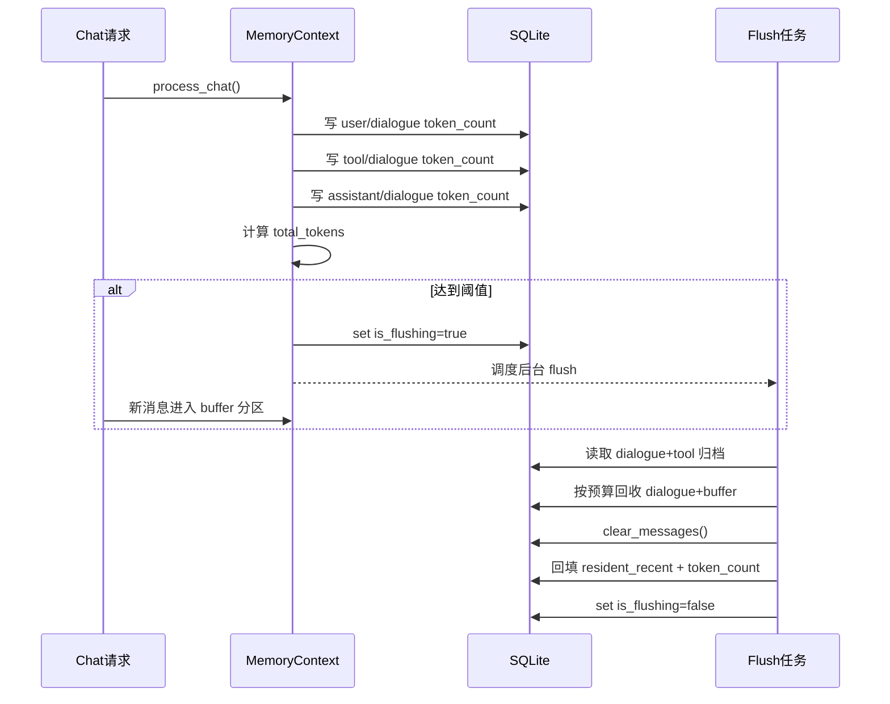

# Token 计算机制详解

## 本文范围

本文聚焦回答以下问题：

- 每次调用 `/chat/stream` 时，token 是如何被计算、入库、汇总的
- 各分区（`resident` / `dialogue` / `tool` / `buffer`）如何贡献到总量
- 何时触发自动刷盘，以及刷盘后 token 如何重建
- OpenAI `usage` 与本地 token 记账之间的关系

本文不覆盖：

- 接口字段定义（见 `api_reference.md`）
- SSE 事件格式（见 `sse_protocol.md`）
- 数据表全量说明（见 `data_model.md`）

## 1. 两套口径：本地记账 vs 模型 usage

项目里同时存在两条 token 相关链路：

1. 本地记账（核心预算依据）
2. 模型返回 `usage`（辅助观测信息）

| 口径 | 来源 | 用途 | 是否参与阈值判断 |
|---|---|---|---|
| 本地记账 token | `infra/llm/kimi_tokenizer_counter.py` | 上下文裁剪、状态面板、刷盘触发 | 是 |
| 模型 `usage` | `response.usage` | 透传到 `assistant_final` 事件 | 否 |

关键点：

- 阈值判断、刷盘调度、前端 Token 仪表盘全部基于“本地记账”。
- `usage` 目前不落库，也不参与 `total_tokens` 计算。

## 2. 总预算与阈值切分

### 2.1 配置来源

- 用户总上限来自 `app_settings.context_total_token_limit`
- 默认值 `200000`
- 最小值保护 `20000`

### 2.2 切分规则

`domain/window_policy.py` 中按固定比例切分：

- `system_prompt_limit` = `10%`
- `summary_limit` = `1%`
- `recent_raw_limit` = `9%`
- `recent_total_limit` = `summary_limit + recent_raw_limit`（10%）
- `resident_limit` = `system_prompt_limit + recent_total_limit`（20%）
- `dialogue_limit` = `total_limit - resident_limit`（约 80%）
- `flush_trigger` = `total_limit`

公式：

```text
normalized_total = max(20000, total_token_limit)
system_prompt_limit = floor(normalized_total * 10%)
summary_limit       = floor(normalized_total * 1%)
recent_raw_limit    = floor(normalized_total * 9%)
resident_limit      = system_prompt_limit + summary_limit + recent_raw_limit
dialogue_limit      = normalized_total - resident_limit
flush_trigger       = normalized_total
```

以 `200000` 为例：

- `system_prompt_limit = 20000`
- `summary_limit = 2000`
- `recent_raw_limit = 18000`
- `resident_limit = 40000`
- `dialogue_limit = 160000`
- `flush_trigger = 200000`



## 3. 单次调用的 token 计算时序



## 4. 各部分 token 的具体计算方式

### 4.1 计数器实现

`KimiTokenizerCounter.count_tokens(text, model)`：

- 基于本地 `infra/llm/tokenizer_assets/tiktoken.model` 构建 Kimi K2.5 编码器
- 使用官方 `tokenization_kimi.py` 的 `pat_str` 与 `tokenizer_config.json` 特殊 token 映射
- 通过本地 `tiktoken` 编码直接得到 token 数，不依赖远端 SDK

`truncate_text_to_tokens(text, limit, model)` 通过“编码后按上限切片再解码”控制预算。

### 4.2 `resident_static_tokens`（常驻静态）

来源：

- 系统提示词（规则 + 工具定义）
- 记忆文件内容
- 工作台摘要（单独 section）

计算步骤：

1. 先生成两段 section：
   - `系统提示词与记忆文件`（预算 `system_prompt_limit`）
   - `工作台摘要`（预算 `summary_limit`）
2. 每段都先算标题 token，再裁剪正文到剩余 budget
3. 将拼好的完整 system 文本整体再计一次 token，得到 `resident_static_tokens`

### 4.3 `resident_recent_tokens`（常驻近期）

来源是 `messages.zone = resident_recent`。

计算方式：

1. 按时间升序读取所有 `resident_recent` 消息
2. 从最新往旧回收，累计到 `recent_raw_limit` 为止
3. 行内 token 优先读取持久化字段 `token_count`，若异常则 fallback 到实时重算

### 4.4 `dialogue_tokens`

来自数据库聚合：

- `SUM(token_count where zone='dialogue')`
- `SUM(token_count where zone='tool')`

二者相加得到：

```text
dialogue_tokens = zone(dialogue) + zone(tool)
```

### 4.5 `buffer_tokens`

来自数据库聚合：

```text
buffer_tokens = zone(buffer)
```

### 4.6 `total_tokens`

最终状态公式：

```text
resident_tokens = resident_static_tokens + resident_recent_tokens
total_tokens = resident_tokens + dialogue_tokens + buffer_tokens
```



## 5. 刷盘期间的 token 行为

### 5.1 进入刷盘前后分区行为

- `is_flushing=false` 时：新消息进入 `dialogue`
- `is_flushing=true` 时：新消息进入 `buffer`
- 这样可以避免刷盘时对正在归档的上下文造成污染

### 5.2 刷盘核心步骤

1. 读取 `dialogue + tool` 作为归档输入，调用 LLM 生成总结并允许工具写记忆
2. 回收最近对话：从 `dialogue + buffer` 中按 `recent_raw_limit` 回收 `user/assistant`
3. 清空当前会话全部消息
4. 将回收结果重建为 `zone=resident_recent`，并重新计 token
5. 更新摘要，设置 `is_flushing=false`



## 6. `usage` 字段的真实含义与边界

`infra/llm/openai_gateway.py` 在每一轮模型请求后执行：

- `latest_usage = extract_usage(response)`

如果存在多轮工具调用，`latest_usage` 会被后续轮覆盖，最终返回“最后一轮”的 usage。

在 SSE 中，`assistant_final` 会附带：

```json
{
  "content": "...",
  "usage": { "...": "..." }
}
```

当前边界：

- `usage` 不会写入 `messages` 表
- `usage` 不参与 `memory_status.total_tokens` 计算
- 前端 Token 仪表盘使用的是 `memory_status`，不是 `assistant_final.usage`

## 7. 自检与排障建议

当你怀疑 token 异常时，可按下面顺序核对：

1. 看 `app_settings.context_total_token_limit` 是否符合预期
2. 看 `memory_status.thresholds` 是否按规则切分
3. 核对 `messages` 表中各 `zone` 的 `token_count` 累计
4. 核对 `resident_recent` 是否被 `recent_raw_limit` 截断
5. 区分“本地总量”与“模型 usage”是否被误混用

可直接使用如下 SQL 快速检查：

```sql
-- 1) 查看分区累计
SELECT zone, COALESCE(SUM(token_count), 0) AS total_tokens
FROM messages
WHERE user_id = ? AND session_id = ?
GROUP BY zone;

-- 2) 查看最近消息及 token
SELECT id, role, zone, token_count, created_at
FROM messages
WHERE user_id = ? AND session_id = ?
ORDER BY id DESC
LIMIT 50;
```

## 8. 关键代码索引

- 阈值策略：`domain/window_policy.py`
- token 计数器：`infra/llm/kimi_tokenizer_counter.py`
- prompt 预算裁剪：`domain/prompt_composer.py`
- 聊天主流程：`app/use_cases/memory_context.py`
- `usage` 提取：`infra/llm/request_builder.py`
- 模型调用与工具循环：`infra/llm/openai_gateway.py`
- token 聚合 SQL：`infra/sqlite/repository.py`
